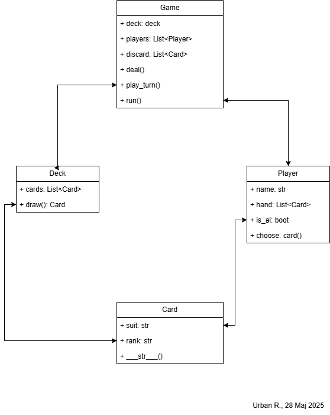
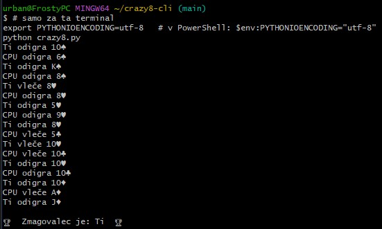
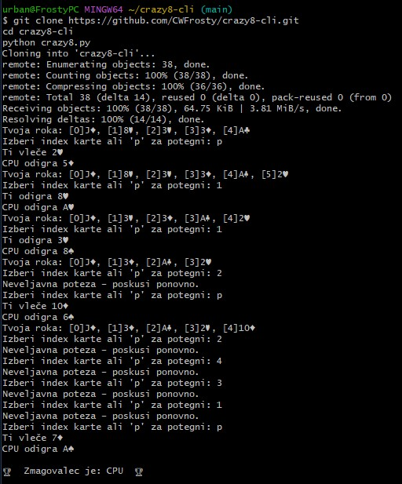

# Crazy 8 CLI

Minimalna ukazno-vrstična (CLI) izvedba igre Crazy 8 za predmet **Razvoj programskih aplikacij**.  
Repo bo služil kot dokaz iterativnega razvoja (LO3) in podlaga za Class diagram ter posnetke zaslona v poročilu.

## TODO (1. iteracija)
- [ ] `Game.run()` – gl zanka igre  
- [ ] `Player.choose_card()` – preprosta AI (prva legalna karta, osmico pusti za konec)  
- [ ] Preverjanje legalnosti poteze  
- [ ] Zaznavanje zmage in izpis rezultatov

### Zagon igre Crazy 8 (Windows)

Odpri terminal v mapi projekta (kjer je crazy8.py).

Če imaš težave z izpisom Unicode znakov (npr. ♠, ♥), najprej nastavi kodiranje:

*export PYTHONIOENCODING=utf-8*

Zaženi igro z ukazom:

*python crazy8.py*

#### ER diagram

#### Posnetek delujoče 1. iteracije

#### Posnetek delujoče 1. iteracije (interaktivni vnos)

#### Posnetek uspešne igre

