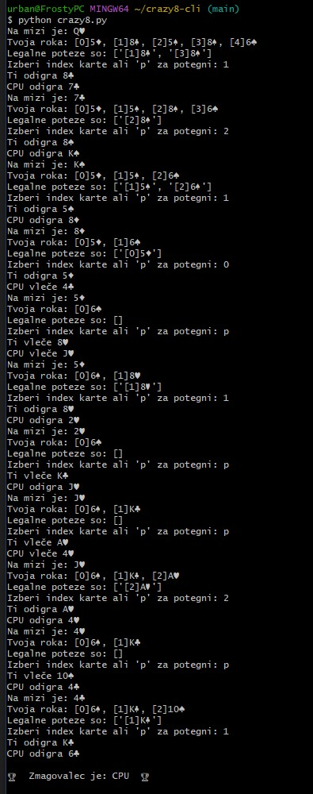

# Crazy 8 CLI

Minimalna ukazno-vrstična (CLI) izvedba igre Crazy 8 za predmet **Razvoj programskih aplikacij**.  
Repo bo služil kot dokaz iterativnega razvoja (LO3) in podlaga za Class diagram ter posnetke zaslona v poročilu.

## TODO (1. iteracija)
- [ ] `Game.run()` – gl zanka igre  
- [ ] `Player.choose_card()` – preprosta AI (prva legalna karta, osmico pusti za konec)  
- [ ] Preverjanje legalnosti poteze  
- [ ] Zaznavanje zmage in izpis rezultatov

### ER diagram

#### Posnetek delujoče 1. iteracije

##### Posnetek delujoče 1. iteracije (interaktivni vnos)

###### Posnetek uspešne igre

